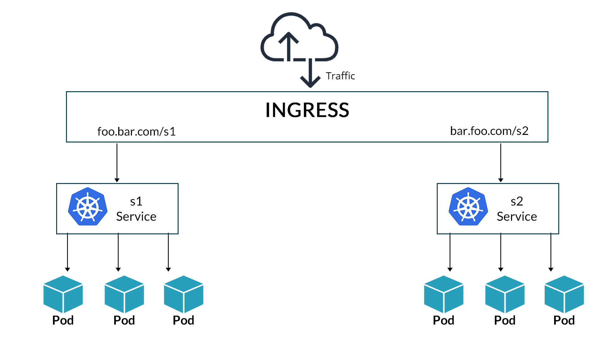

# Ingress networking

A Kubernetes application deployment may involve some published resources. For that case, the ingress layer is introduced. We can see it like a load balancer pointed by a DNS record. This load balancer is responsible to redirect incoming traffic to the right application service.

On services like Google Cloud, the ingress service is implemented with a LoadBalancer service type.



The ingress service is published using a node port or a network load balancer. All SSL and routing configuration is managed in the ingress service which routes traffic to the appropiate application service depending on the required URL.

The ingress service is composed by two main components:

- Ingress controller: LoadBalancer service. Without kubernetes this is an inverse proxy (nginx, HAProxy, Traeffik)
- Ingress resources: configuration rules like URL routes, SSL certificates. Without kubernetes this the inverse proxy configuration.

Kubernetes does not have an ingress controller by default, so you must deploy one. To name some:

- GCP HTTP(S) Load Balancer (on GCE)
- Nginx
- Contour
- HAProxy
- Traefik
- Istio

GCE and Nginx are being supported and maintained by the Kubernetes project.

## Nginx ingress controller deployment

An ingress controller is deployed as any other Kubernetes deployment, so we can define it using a deployment yaml file using an specific image. In the following sample, we define an ingress controller which uses a special nginx image.

```nginx-ingress-controller.yaml
apiVersion: apps/v1
kind: Deployment
metadata:
    name: nginx-ingress-controller
spec:
    replicas: 1
    selector:
        matchLabels:
            name: nginx-ingress
    template:
        metadata:
            labels:
                name: nginx-ingress
        spec:
            containers:;
                - name: nginx-ingress-c
                  image: quay.io/kubernetes-ingress-controller/nginx-ingress-controller:0.21.0
                  args:
                    - /nginx-ingress-controller
                    - --configmap=$(POD_NAMEPSACE)/nginx-configuration
                  env:
                    - name: POD_NAME
                      valueFrom:
                        fieldRef:
                            fieldPath: metadata.name
                    - name: POD_NAMESPACE
                      valueFrom:
                        fieldRef:
                            fieldPath: metadata.namespace
                  ports:
                    - name: http
                      containerPort: 80
                    - name: https
                      containerPort: 443
```
Note the `configmap` used to manage configuration:

```
apiVersion: v1
kind: ConfigMap
metadata:
    name: nginx-configuration
```

We also need to define a service to expose the deployment to the world:

```
apiVersion: v1
kind: Service
metadata:
    name: nginx-ingress
spec:
    type: NodePort
    ports:
    - port: 80
      targetPort: 80
      protocol: TCP
      name: http
    - port: 443
      targetPort: 443
      name: https
    selector:
      name: nginx-ingress
```
The nginx ingress controller has additional features to monitor the Kubernetes cluster for ingress resources and configure the underlying nginx server when something changes. For this purpose we need a service account.

```
apiVersion: v1
kind: ServiceAccount
metadata:
    name: nginx-ingress-serviceaccount
```

To summarize,  what we need to define an ingress service?

- An ingress controller deployment
- An ingress controller configuration (the config map)
- The ingress service
- A service account

## Ingress resource

An ingress resource is a set of rules and configurations applied on the ingress controller. Rules can be configured to simply forward incomming traffic to applications based on requested URLs.

The ingress resource is created using a Kubernetes definition file. Note that traffic is directed to a service (not to application pods directly). The `defaultBackend` service defines where the traffic is routed. In that simple example, all traffic is handled by port 80

```
apiVersion: networking.k8s.io/v1
type: Ingress
metadata:
    name: ingress-wear
spec:
    defaultBackend:
        service:
            name: wear-service
            port: 80
```
Ingress can handle routes for domains and paths.

### Configure paths
To configure different paths we define an array pf paths:

```
apiVersion: networking.k8s.io/v1
type: Ingress
metadata:
    name: ingress-wear-watch
spec:
    rules:
    - http:
        paths:
        - path: /wear
          backend:
            service:
                name: wear-service
                port: 80
        - path: /watch
          backend:
            service:
                name: watch-service
                port: 80
```
After cretaing such ingress, we can check the rules with the `kubectl describe ingress ingress-wear-watch` command.
Routes not matching `/wear` nor `/watch` will be managed by the default service.

### Configure domain names

```
apiVersion: networking.k8s.io/v1
type: Ingress
metadata:
    name: ingress-wear-watch
spec:
    rules:
    - host: wear.my-online-store.com
      http:
        paths:
        - path: /wear
          backend:
            service:
                name: wear-service
                port: 80
    - host: watch.my-online-store.com
      http:
        - path: /watch
          backend:
            service:
                name: watch-service
                port: 80
```

## References
[Kubernetes Ingress](https://kubernetes.io/docs/concepts/services-networking/ingress/)
